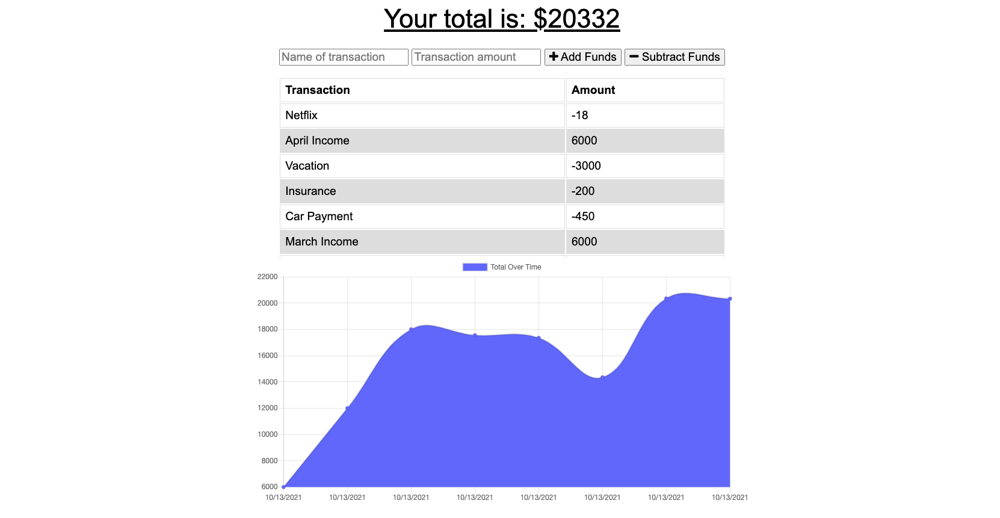

# Easy Budget Tracker

## Screenshot

## Description

Welcome to Easy Budget Tracker, a progressive web application (PWA) that allows users to add expenses and deposits to their budget, regardless of whether the user is connected to the Internet or not. If the user enters transactions offline, the changes will be reflected when they're brought back online. This application uses IndexDB, Service workers, and Web Manifest for offline functionality and is deployed on Heroku.

## Table of Contents

- [Links](#links)
- [Installation](#installation)
- [Tech Used](#tech-used)
- [Questions](#questions)
- [License](#license)

## Links

- **[GitHub Repo](https://github.com/mjos7/easy-budget-tracker)**
- [Deployed App - Heroku](https://desolate-brushlands-46331.herokuapp.com/)

## Installation

- Both Node.js and Mongo must be installed on your computer.
- Navigate to the root directory and run:
  - `npm install`
- To start the server, in the command line run:
  - `npm start`

## Tech Used

- Express
- Node
- IndexedDB
- Web Manifest
- Service Workers
- MongoDB
- Mongoose

## Questions

Please don't hesitate to reach out if you have any suggestions or feedback

## License

This app is licensed under the MIT license.
